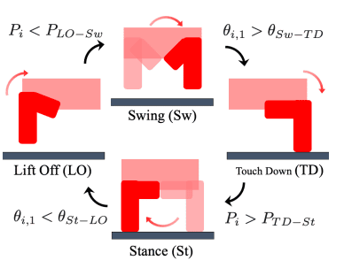
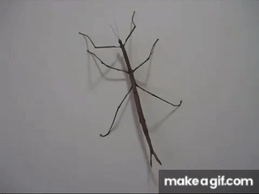
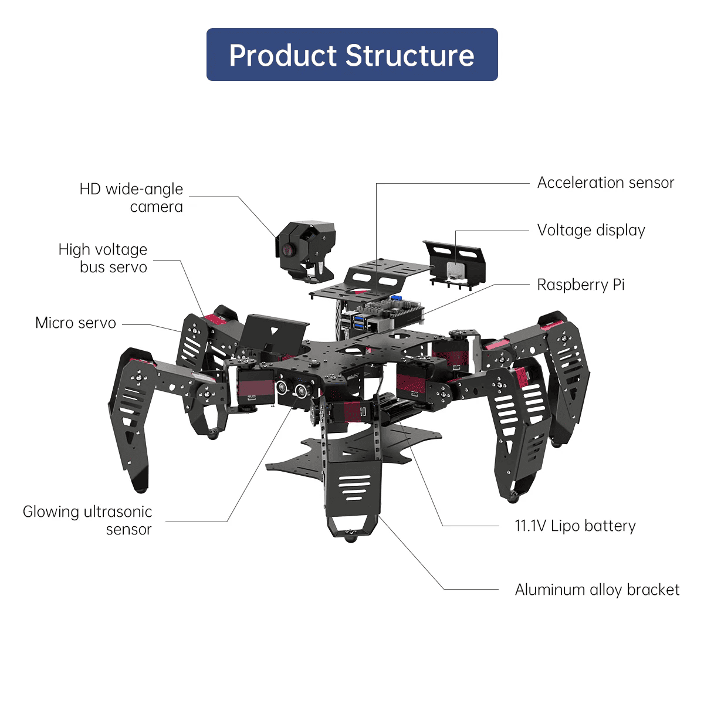

# Bio-Inspired Reflex Control for Hexapod Locomotion

### Sim-to-Real Hardware Implementation on the 18-DOF Hiwonder SpiderPi Platform

This repository contains the core control architecture, real-time filtering, and debugging tools developed for my *
*Master’s Thesis**. Originally initiated as a COLABS research project at **Tohoku University’s Neuro-Robotics Laboratory
**, this work focuses on transferring a decentralized, biologically inspired locomotion control framework from
simulation to physical hardware.

---

## Project Executive Summary

Traditional legged locomotion often relies on computationally intensive centralized planning or explicit global models
that struggle under real-world hardware latency and unpredictable terrain. This project explores a bio-inspired
alternative: **pure, decentralized reflex-based control** modeled after the stick insect (*Carausius morosus*).

The primary objective was **Sim-to-Real deployment** — taking behavioral principles validated in MuJoCo computer
simulations and adapting them to a physical, resource-constrained 18-DOF hexapod robot (Hiwonder SpiderPi). By
demonstrating that robust forward locomotion can spontaneously emerge from local sensory-motor loops without explicit
inter-limb communication coordination, this work highlights a path toward low-overhead, highly adaptive robotic control.

---

## Technical Core

The architecture directly addresses key challenges in real-world motion control systems:

### 1. State Estimation & Sensory Feedback

* **Proprioceptive Force Approximation:** To circumvent hardware constraints (lack of an external foot-force sensor
  array), ground contact and leg load were dynamically approximated by monitoring real-time servo voltage
  variations ($\Delta V$).
* **Kalman Filtering:** Raw voltage metrics were heavily corrupted by electrical noise. A tailored **Kalman Filter** was
  implemented to smooth voltage inputs, stabilizing state transitions without completely sacrificing the responsiveness
  needed to detect sudden load changes.

### 2. Gait Generation & Kinematic Control


> **Diagram acquired from**:
> W. Sato, J. Nishii, M. Hayashibe, and D. Owaki, *"Morphological characteristics that enable stable and efficient
walking in hexapod robot driven by reflex-based intra-limb coordination,"* in **2023 IEEE International Conference on
Robotics and Automation (ICRA)**, 2023, pp.
> 12,127–12,133. [Available on ResearchGate](https://www.researchgate.net/publication/372127136_Morphological_Characteristics_That_Enable_Stable_and_Efficient_Walking_in_Hexapod_Robot_Driven_by_Reflex-based_Intra-limb_Coordination)

* **4-Phase State Machine:** Implemented a decentralized intra-limb gait cycle consisting of **Touch Down (TD)**, *
  *Stance (St)**, **Lift Off (LO)**, and **Swing (Sw)** phases.
* **Foot Trajectory & Slip Mitigation:** Addressed real-world kinematic slipping by altering the Stance phase profile to
  apply a dual vector—driving the leg downward to maximize friction while concurrently propelling the body backward.

### 3. Real Robot Debugging & System Constraints

* **Multi-Threaded Asynchronous UART:** Concurrently managing 18 bus servos over a single shared serial bus introduced
  massive communication bottlenecks. Reading all joint positions and voltages sequentially created a ~1.0s latency,
  crippling real-time control.
* **Command Windowing Interleaving:** Resolved bus collisions by architecting a strict time-interleaved "windowing"
  scheme, partitioning execution blocks into dedicated high-speed writing pulses followed by localized data reading
  windows. This reduced loop diagnostic latency down to **~0.3s**.

### 4. Controller Tuning & Stability Optimization

* **Adaptive Voltage Thresholding:** To prevent the robot body from collapsing or tilting violently under uneven torque
  responses across different actuators, an adaptive thresholding law was designed. The voltage target adjusts
  dynamically based on the deviance between the optimal knee joint angle and its actual position, ensuring the center of
  mass stays consistently level above the ground.

---

## Project Achievements & Results

* **Successful Sim-to-Real Baseline:** Evaluated physical morphology configurations against prior simulation data,
  discovering that market-standard morphology profiles maximized ground-clearance torque and signal readability on real
  hardware constraints.
* **Hardware-Validated Robustness:** Achieved autonomous, stable forward locomotion across both flat surfaces and
  moderately uneven terrain without any top-down global gait coordination.
* **Performance Velocity:** Fine-tuned an optimal parameter matrix (balancing filter covariance, stance push-down
  factors, and safety damping coefficients) to achieve stable walking at a velocity of two body lengths per 60 seconds.




Interactive measured data. Click the link below to zoom, pan, and toggle individual leg joints or filter out voltage noise in real-time.

<p align="center">
  <a href="https://kopecon.github.io/reflex-based-control-for-hiwonder-spiderpi/" target="_blank">
    
  </a>
</p>

---

## Repository Structure

```
.
├── control_system_class.py     # Core decentralized reflex control system & state machine logic
├── hexapod_class.py             # Robot abstraction layer managing the 6-limb threading topology
├── kalman_filter.py             # Sensor state estimation (voltage noise reduction & signal smoothing)
├── morphology_class.py          # Physical joint origin offsets and initial configuration profiles
├── control_system_prototypes.py # Iterative control laws, trajectory variations, and development logs
├── real_time_graph_class.py     # Live diagnostic utilities for multi-channel joint parameter tuning
├── plotly_graph_generator.py    # Post-run interactive data viz (gait phase analysis & voltage plots)
└── HiwonderSDK/                 # Lower-level hardware interface abstraction and serial UART drivers
```

---

## Key Engineering Parameters Tuned

To demonstrate deep control-intuition, the repository exposes highly sensitive inter-dependent parameters critical for
physical balance:

* **$\theta$ (Shoulder Stroke Amplitude):** Defines the angular displacement during the Stance/Swing phases.
* **Kalman Filter $R$ Matrix (Scalar):** Dictates the measurement error covariance; tuned tightly to balance noise
  rejection against loop responsiveness.
* **Stance Push Down Factor:** Proportional gain multiplier forcing downward foot pressure during propulsion to entirely
  negate leg slip.

---

## Hardware Platform Specification


> **The structural design and platform guidelines are based on the SpiderPi platform:**
> Hiwonder, *"Hiwonder SpiderPi: AI Intelligent Visual Hexapod Robot Powered by Raspberry Pi 5,"* Product
> Specification & Documentation,2024. [Available on Hiwonder](https://www.hiwonder.com/products/spiderpi?variant=40213126381655)

The framework was validated on the **Hiwonder SpiderPi** utilizing:

* **Central Processing Unit:** Raspberry Pi 4B acting as the real-time control node.
* **Actuation Layer:** 18x Hiwonder LX-224HV High-Voltage Bus Servos communicating over a TTL UART Serial bus interface.
* **Power Delivery:** 11.1V 2500mAh 10C LiPo Battery.

---
*Maintained by kopecon. Developed in partnership with Czech Technical University in Prague and Tohoku University.*